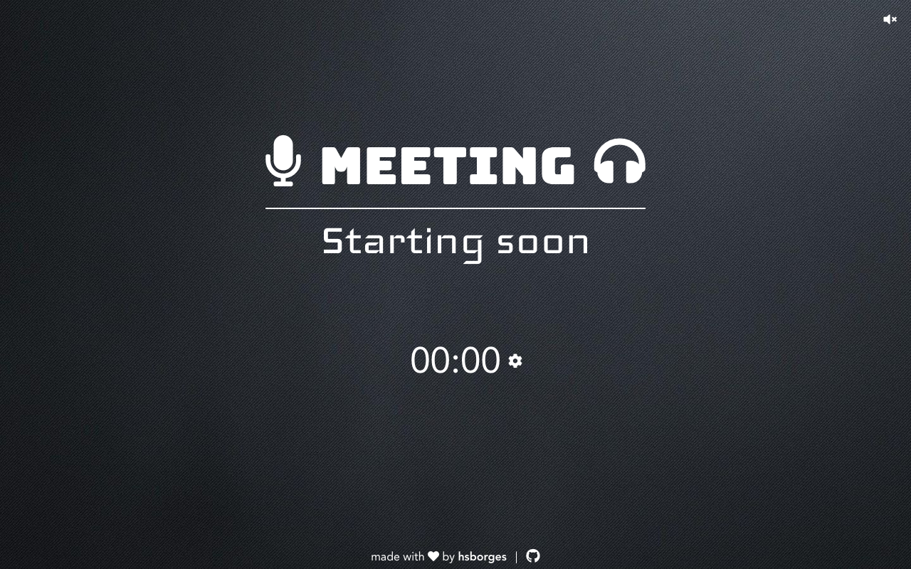

# Meeting Waiting Room

Meeting Waiting Room is a simple application built using [Vue.js](https://vuejs.org/) intended to be used in virtual classes before it starts. Try online on https://hsborges.github.io/waiting-room.

## Contributing

Pull requests are welcome. For major changes, please open an issue first to discuss what you would like to change.

## License

This project is licensed under the MIT License - see the [LICENSE.md](LICENSE.md) file for details
